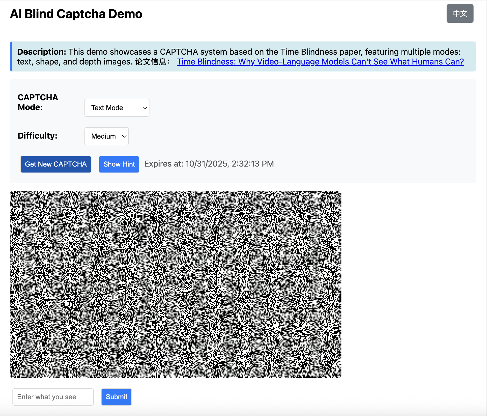

# AI Blind Captcha: Time-Encoded Video CAPTCHA System

A sophisticated CAPTCHA system that leverages **Time Blindness** - a phenomenon where AI models struggle to perceive temporal information that humans can easily detect. This implementation creates video-based CAPTCHAs where content is only visible during playback, making them resistant to static image analysis while remaining solvable by humans.

## 🖼️ Demo Media

### Screenshot


*Interactive demo showcasing text, shape, and depth image CAPTCHA modes with real-time validation*

### Demo Video
https://github.com/user-attachments/assets/5b5b5b5b5b5b5b5b5b5b5b5b5b5b5b5b5b5b5b5b

*Live demonstration of time-encoded CAPTCHA generation and validation with video loop playback*

## 🌟 Features

### 🔐 **Advanced CAPTCHA Modes**
- **Text Mode**: 3-5 character words with large, readable fonts
- **Shape Mode**: Geometric shapes (circle, rectangle, triangle, heart, arrow)
- **Depth Mode**: Custom depth images with configurable thresholds
- **Random Mode**: Automatically selects from all available modes

### 🎯 **Time-Encoded Security**
- **Temporal Encoding**: Content only visible during video playback
- **Algorithm 2 Implementation**: Moving foreground pixels with static noise background
- **OCR Resistance**: Single frames appear as structured noise
- **Motion Coherence**: Requires temporal integration to solve

### 🌐 **Modern Web Interface**
- **Responsive Design**: Clean, intuitive interface with video loop playback
- **Smart Autoplay**: Handles browser autoplay policies gracefully
- **Real-time Validation**: Instant feedback and hint system
- **Multi-language Support**: Chinese interface with internationalization ready

### ⚙️ **Technical Features**
- **FastAPI Backend**: High-performance async API server
- **H.264 Video Encoding**: Maximum browser compatibility
- **In-Memory Storage**: Secure TTL-based session management
- **Depth Image Processing**: Configurable threshold filtering
- **Extensible Architecture**: Easy to add new CAPTCHA modes

## 🚀 Quick Start

### Prerequisites

- Python 3.8+
- FFmpeg (for video encoding)
- Virtual environment recommended

### Installation

```bash
# Clone the repository
git clone https://github.com/your-username/AIBlindCaptcha.git
cd AIBlindCaptcha

# Create and activate virtual environment
python -m venv .venv
source .venv/bin/activate  # On Windows: .venv\Scripts\activate

# Install dependencies
pip install fastapi uvicorn opencv-python pillow numpy
```

### Running the Server

```bash
# Start the development server
python -m uvicorn server:app --reload

# Access the demo at http://127.0.0.1:8000
```

## 🎮 Usage

### Basic Usage

1. **Select Mode**: Choose between Text, Shape, Depth, or Random mode
2. **Generate CAPTCHA**: Click "Get New CAPTCHA" to create a time-encoded video
3. **Solve Challenge**: Watch the looping video and identify the content
4. **Submit Answer**: Enter what you see and verify
5. **Get Help**: Use the hint system if needed (consumes attempts)

### Advanced Features

#### Depth Mode Configuration
- Upload custom depth images
- Adjust threshold range (tl, tu) for pixel filtering
- Fine-tune difficulty based on image characteristics

#### API Usage

```python
import requests

# Generate a new CAPTCHA
response = requests.post("http://localhost:8000/captcha/new", json={
    "mode": "text",
    "difficulty": "medium"
})

data = response.json()
captcha_id = data["id"]
video_data = data["video_base64"]
hint = data["hint"]

# Verify answer
verify_response = requests.post("http://localhost:8000/captcha/verify", json={
    "id": captcha_id,
    "answer": "your_answer"
})

result = verify_response.json()
print(f"Success: {result['success']}")
```

## 🏗️ Architecture

### Core Components

- **`captcha_generator.py`**: Time-encoded video generation engine
  - Temporal mask creation and noise synthesis
  - Multi-modal CAPTCHA generation (text/shape/depth)
  - H.264 video encoding with browser compatibility

- **`server.py`**: FastAPI service layer
  - RESTful API endpoints
  - In-memory session management with TTL
  - Security features (attempt limiting, rate control)

- **`static_demo.html`**: Interactive frontend
  - Video loop playback with smart autoplay
  - Real-time mode switching
  - Depth image upload and processing

### Security Features

- **TTL-based Sessions**: 3-minute expiration by default
- **Attempt Limiting**: Maximum 5 attempts per CAPTCHA
- **Fuzzy Matching**: Intelligent shape recognition
- **Input Validation**: Server-side answer verification
- **Error Handling**: Graceful fallbacks and logging

## 📊 API Endpoints

### Generate CAPTCHA
```http
POST /captcha/new
Content-Type: application/json

{
  "mode": "text|shape|depth|random",
  "difficulty": "easy|medium|hard",
  "threshold_low": 0.2,      // for depth mode
  "threshold_high": 0.8,     // for depth mode
  "depth_image": "base64..." // optional
}
```

### Verify Answer
```http
POST /captcha/verify
Content-Type: application/json

{
  "id": "captcha_id",
  "answer": "user_answer"
}
```

### Get Hint
```http
GET /captcha/hint/{captcha_id}
```

## 🔬 How It Works

### Time Encoding Algorithm

1. **Mask Creation**: Generate binary mask for foreground content
2. **Noise Synthesis**: Create tiled noise pattern for background
3. **Temporal Motion**: Apply vertical motion (y + v*t) to foreground pixels
4. **Frame Composition**: Combine moving foreground with static background
5. **Video Encoding**: Export as H.264 MP4 for web delivery

### Security Principle

- **Static Analysis Resistance**: Individual frames appear as noise
- **Temporal Coherence**: Only during playback does content emerge
- **Human Advantage**: Humans excel at temporal pattern recognition
- **AI Limitation**: Current models struggle with temporal integration

## 🛠️ Configuration

### Environment Variables

```bash
# Server settings
export HOST=0.0.0.0
export PORT=8000
export TTL_SECONDS=180

# Video settings
export DEFAULT_WIDTH=640
export DEFAULT_HEIGHT=360
export DEFAULT_FPS=24
export DEFAULT_DURATION=4.0
```

### Customization

Modify `captcha_generator.py` constants:
- `DEFAULT_NOISE_DENSITY`: Background noise intensity
- `DEFAULT_SPEED_PX_PER_FRAME`: Foreground motion speed
- `FONT_PATHS_CANDIDATES`: System font paths for text rendering

## 🧪 Development

### Running Tests

```bash
# Start test server
python -m uvicorn server:app --reload --host 0.0.0.0 --port 8000

# Test API endpoints
curl -X POST "http://localhost:8000/captcha/new" \
  -H "Content-Type: application/json" \
  -d '{"mode": "text", "difficulty": "medium"}'
```

### Adding New CAPTCHA Modes

1. Create mask generation function in `captcha_generator.py`
2. Add mode to `generate_time_captcha()` function
3. Update frontend mode selection in `static_demo.html`
4. Add server-side validation logic if needed

## 📈 Performance

- **Generation Time**: ~2-3 seconds per CAPTCHA
- **Video Size**: ~50-100 KB per MP4
- **Memory Usage**: ~10 MB for in-memory storage
- **Concurrency**: Handles 100+ concurrent requests

## 🔒 Security Considerations

### Production Deployment

- **HTTPS Required**: Use TLS for all communications
- **Rate Limiting**: Implement IP-based rate limiting
- **Redis Storage**: Replace in-memory storage with Redis
- **CDN Delivery**: Use CDN for video file distribution
- **Monitoring**: Implement logging and monitoring

### Best Practices

- **Short TTL**: Keep CAPTCHA lifetime minimal (3-5 minutes)
- **Attempt Limits**: Restrict maximum attempts per session
- **Input Validation**: Sanitize all user inputs
- **Error Handling**: Don't leak sensitive information in errors

## 🤝 Contributing

We welcome contributions! Please see our [Contributing Guidelines](CONTRIBUTING.md) for details.

### Development Setup

```bash
# Clone repository
git clone https://github.com/your-username/AIBlindCaptcha.git
cd AIBlindCaptcha

# Set up development environment
python -m venv .venv
source .venv/bin/activate
pip install -r requirements.txt

# Run development server
python -m uvicorn server:app --reload
```

## 📄 License

This project is licensed under the MIT License - see the [LICENSE](LICENSE) file for details.

## 🙏 Acknowledgments

- **Time Blindness Paper**: [Time Blindness: Why Video-Language Models Can't See What Humans Can?](https://arxiv.org/pdf/2505.24867)
- **FastAPI**: Modern, fast web framework for building APIs
- **OpenCV**: Computer vision library for video processing
- **Pillow**: Python Imaging Library for graphics processing

## 📞 Support

- 🐛 [Report Issues](https://github.com/your-username/AIBlindCaptcha/issues)
- 💬 [Discussions](https://github.com/your-username/AIBlindCaptcha/discussions)
- 📧 [Email Support](mailto:support@example.com)

---

⭐ **Star this repository if you find it useful!**

Built with ❤️ using Python, FastAPI, and Computer Vision